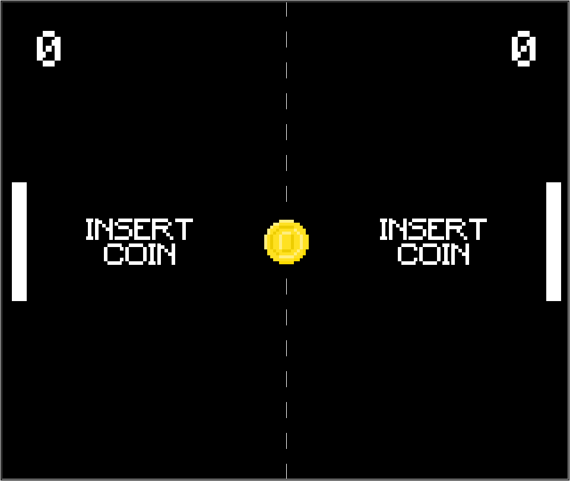

# Pong in Python 
Made with Tkinter and Turtle.

## Quick Start

	git clone https://github.com/mxilinas/pypong.git
	cd pypong
	pip install -r requirements.txt
	python pong.py

## Controls

- Press "1" for single player
- Press "2" for multiplayer
- Player1: w & s
- Player2: up & down
- Exit game: escape
